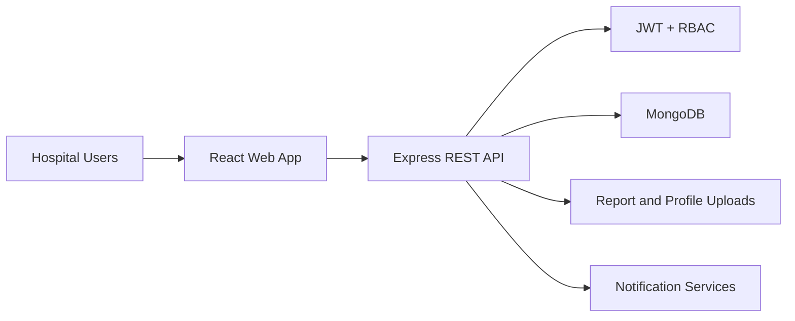

# System Architecture

## Backend Modules

- Authentication and authorization
- User management
- Departments
- Doctors and schedules
- Patients and medical history
- Appointments
- Electronic medical records
- Prescriptions
- Laboratory
- Pharmacy
- Billing
- Notifications
- Reports and uploads

## Frontend Areas

- Public authentication screens
- Role-aware application shell
- Admin dashboard
- Doctor workspace
- Nurse workspace
- Reception workspace
- Patient portal
- Pharmacy workspace
- Laboratory workspace
